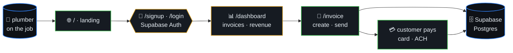

# PlumberPay

> Invoice on-site for plumbers. Create an invoice in seconds, send it
> to the customer, and get paid before you leave the driveway. No
> contracts, no hidden fees.



## Table of contents

- [Stack](#stack)
- [Architecture](#architecture)
- [Getting Started](#getting-started)

## Stack

- Next.js 16 + React 19 + Tailwind CSS 4
- Supabase (auth + database)
- Vercel deployment
- TypeScript strict mode

## Architecture

- `/` — Landing page
- `/signup`, `/login` — Auth flows (Supabase)
- `/dashboard` — Invoices, revenue, KPIs
- `/invoice` — Create / view invoices

## Getting Started

```bash
npm install
npm run dev
```

Open [http://localhost:3000](http://localhost:3000).
